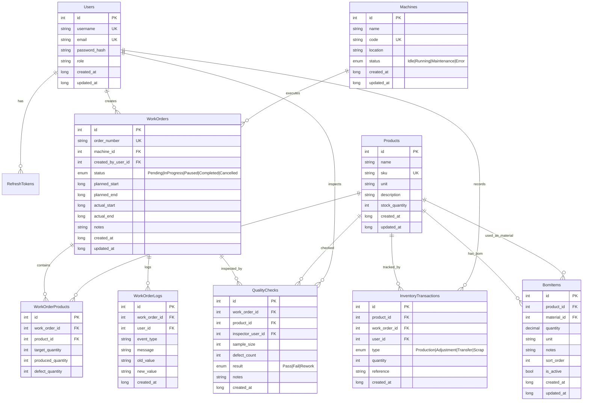

# 🏭 Mini MES – Manufacturing Execution System (Backend)

> Hệ thống quản lý sản xuất (MES) thời gian thực, xây dựng trên **.NET 10** với kiến trúc RESTful API + **SignalR WebSocket**.

---

## 📋 Mục lục

- [Tổng quan](#-tổng-quan)
- [Tech Stack](#-tech-stack)
- [Kiến trúc dự án](#-kiến-trúc-dự-án)
- [Cấu trúc thư mục](#-cấu-trúc-thư-mục)
- [Database Schema](#-database-schema)
- [Real-time (SignalR)](#-real-time-signalr)
- [Cài đặt & Chạy dự án](#-cài-đặt--chạy-dự-án)
- [Cấu hình](#️-cấu-hình)
- [Production Simulator](#-production-simulator)

---

## 🎯 Tổng quan

**Mini MES** là hệ thống backend phục vụ quản lý sản xuất trong nhà máy, bao gồm các chức năng chính:

| Module                      | Mô tả                                                                    |
| --------------------------- | ------------------------------------------------------------------------ |
| **Authentication**          | Đăng ký, đăng nhập, refresh/revoke token, reset mật khẩu (JWT)           |
| **Products**                | CRUD sản phẩm (tên, SKU, đơn vị, tồn kho)                                |
| **Machines**                | CRUD máy móc, theo dõi trạng thái (Idle/Running/Maintenance/Error)       |
| **Work Orders**             | Quản lý lệnh sản xuất, theo dõi tiến độ, ghi nhận output                 |
| **Quality Checks**          | Kiểm tra chất lượng sản phẩm (Pass/Fail/Rework)                          |
| **Inventory**               | Quản lý tồn kho, giao dịch nhập/xuất/sản xuất/điều chỉnh                 |
| **Dashboard**               | Tổng hợp KPI sản xuất real-time                                          |
| **BOM (Bill of Materials)** | Định mức nguyên vật liệu, quản lý cấu trúc sản phẩm và kiểm tra vòng lặp |
| **Real-time Hub**           | Push events qua SignalR (output, trạng thái máy, dashboard)              |

---

## 🛠 Tech Stack

| Thành phần         | Công nghệ                           |
| ------------------ | ----------------------------------- |
| **Framework**      | .NET 10 (ASP.NET Core)              |
| **ORM**            | Entity Framework Core 10            |
| **Database**       | SQL Server (Docker)                 |
| **Authentication** | JWT Bearer (Access + Refresh Token) |
| **Hashing**        | BCrypt.Net                          |
| **Validation**     | FluentValidation                    |
| **Object Mapping** | Mapster                             |
| **Real-time**      | SignalR                             |
| **Logging**        | Serilog (Console sink)              |
| **API Docs**       | OpenAPI + Scalar                    |

---

## 🏗 Kiến trúc dự án

```
┌──────────────────────────────────────────────────────────────┐
│                       Client (FE)                            │
│               REST API  ←→  SignalR WebSocket                │
└──────────────┬───────────────────────┬───────────────────────┘
               │                       │
┌──────────────▼───────────────────────▼───────────────────────┐
│                    Middleware Pipeline                        │
│  ExceptionMiddleware → Serilog → Auth → CORS → Routing       │
└──────────────┬───────────────────────────────────────────────┘
               │
┌──────────────▼───────────────────────────────────────────────┐
│                      Controllers (v1)                        │
│  Auth │ Product │ Machine │ WorkOrder │ QC │ Inventory │ Dash│
└──────────────┬───────────────────────────────────────────────┘
               │
┌──────────────▼───────────────────────────────────────────────┐
│                    Services (Business Logic)                  │
│  AuthService │ JwtService │ ProductService │ MachineService   │
│  WorkOrderService │ QualityCheckService │ InventoryService    │
│  DashboardService                                            │
└──────────────┬───────────────────────────────────────────────┘
               │
┌──────────────▼───────────────────────────────────────────────┐
│                   Data Layer (EF Core)                        │
│              AppDbContext + Fluent API Config                 │
│                    SQL Server Database                        │
└──────────────────────────────────────────────────────────────┘
               ↑
┌──────────────┴───────────────────────────────────────────────┐
│               Background Services                            │
│          ProductionSimulatorService (demo/test)               │
│            ↓ broadcasts via SignalR Hub                       │
└──────────────────────────────────────────────────────────────┘
```

**Đặc điểm kiến trúc:**

- **Global JWT Authentication** – Tất cả endpoint mặc định yêu cầu Bearer token. Dùng `[AllowAnonymous]` để opt-out.
- **Standardized API Response** – Mọi response tuân theo format `ApiResponse<T>` thống nhất.
- **Global Exception Handling** – `ExceptionMiddleware` bắt mọi exception và trả về JSON chuẩn.
- **FluentValidation** – Tự động validate request DTO, lỗi trả về dạng `ApiResponse`.
- **Snake_case Convention** – Column names, keys, indexes trong DB đều dùng snake_case.

---

## 📁 Cấu trúc thư mục

```
mini-mes-be/
├── BackgroundServices/           # Hosted services chạy nền
│   └── ProductionSimulatorService.cs   # Mô phỏng sản xuất cho demo
├── Constants/
│   └── ErrorMessages.cs          # Centralized error/success messages
├── Controllers/                  # API Controllers (route: /v1/...)
│   ├── AuthController.cs         #   POST register, login, refresh, revoke, reset_password; GET me
│   ├── BomController.cs          #   CRUD BOM items + batch set
│   ├── DashboardController.cs    #   GET summary
│   ├── InventoryController.cs    #   GET stock, transactions; POST transaction
│   ├── MachineController.cs      #   CRUD machines + PATCH status
│   ├── ProductController.cs      #   CRUD products
│   ├── QualityCheckController.cs #   GET all; POST create
│   └── WorkOrderController.cs    #   CRUD + PATCH status + POST output
├── Data/
│   └── AppDbContext.cs           # EF Core DbContext + Fluent API configuration
├── DTOs/                         # Data Transfer Objects
│   ├── ApiResponse.cs            #   Unified response wrapper
│   ├── Auth/                     #   Register, Login, Token, ResetPassword DTOs
│   ├── Bom/                      #   BOM request/response DTOs
│   ├── Dashboard/                #   Summary response DTOs
│   ├── Inventory/                #   Stock & transaction DTOs
│   ├── Machines/                 #   Machine request/response DTOs
│   ├── Pagination/               #   PaginatedRequest, PaginatedResponse
│   ├── Products/                 #   Product request/response DTOs
│   ├── QualityChecks/            #   QC request/response DTOs
│   └── WorkOrders/               #   WorkOrder request/response DTOs
├── Extensions/
│   ├── ServiceExtensions.cs      # DI registration (DB, JWT, validation, services)
│   └── StringExtensions.cs       # ToSnakeCase() helper
├── Hubs/
│   └── MesHub.cs                 # SignalR Hub – real-time MES events
├── Middlewares/
│   ├── AppValidationException.cs # Custom validation exception
│   └── ExceptionMiddleware.cs    # Global exception handler
├── Migrations/                   # EF Core migration files
├── Models/                       # Domain entities
│   ├── BaseEntity.cs             #   Shared fields: id, created_at, updated_at
│   ├── Enums/
│   │   ├── InventoryTransactionType.cs  # Production, Adjustment, Transfer, Scrap
│   │   ├── MachineStatus.cs             # Idle, Running, Maintenance, Error
│   │   ├── QualityCheckResult.cs        # Pass, Fail, Rework
│   │   └── WorkOrderStatus.cs          # Pending, InProgress, Paused, Completed, Cancelled
│   ├── BomItem.cs
│   ├── InventoryTransaction.cs
│   ├── Machine.cs
│   ├── Product.cs
│   ├── QualityCheck.cs
│   ├── RefreshToken.cs
│   ├── User.cs
│   ├── WorkOrder.cs
│   ├── WorkOrderLog.cs
│   └── WorkOrderProduct.cs
├── Repositories/
│   └── IRepository.cs            # Generic repository interface
├── Services/                     # Business logic layer
│   ├── IAuthService.cs / AuthService.cs
│   ├── IJwtService.cs / JwtService.cs
│   ├── IBomService.cs / BomService.cs
│   ├── IProductService.cs / ProductService.cs
│   ├── IMachineService.cs / MachineService.cs
│   ├── IWorkOrderService.cs / WorkOrderService.cs
│   ├── IQualityCheckService.cs / QualityCheckService.cs
│   ├── IInventoryService.cs / InventoryService.cs
│   └── IDashboardService.cs / DashboardService.cs
├── Validators/                   # FluentValidation rules
│   ├── BomValidator.cs
│   ├── MachineValidator.cs
│   ├── ProductValidator.cs
│   ├── QualityCheckValidator.cs
│   ├── RegisterRequestValidator.cs
│   ├── ResetPasswordRequestValidator.cs
│   └── WorkOrderValidator.cs
├── Properties/
├── Program.cs                    # Application entry point & middleware pipeline
├── appsettings.json              # Shared configuration
├── appsettings.Development.json  # Dev-specific config (JWT key, DB)
├── appsettings.Production.json   # Prod-specific config (JWT key, DB) ⚠️ gitignored
├── generate-jwt-keys.sh          # Script sinh JWT SecretKey tự động
└── mini-mes-be.csproj            # Project file & NuGet dependencies
```

---

## 🗄 Database Schema



---

## ⚡ Real-time (SignalR)

### Kết nối

```javascript
const connection = new signalR.HubConnectionBuilder()
  .withUrl("http://localhost:5130/mes-hub", {
    accessTokenFactory: () => jwtAccessToken,
  })
  .withAutomaticReconnect()
  .build();

await connection.start();
```

### Auto-subscription khi connect

Khi client kết nối thành công, server tự động:

1. Join group `User_{userId}` (events riêng user)
2. Join group `Dashboard` (KPI updates)
3. Tìm các máy đang có lệnh sản xuất active → auto-join `Machine_{machineId}`
4. Gửi event `Connected` về client kèm danh sách machines đã subscribe

### Server → Client Events

| Event                     | Mô tả                                            |
| ------------------------- | ------------------------------------------------ |
| `Connected`               | Thông tin kết nối + danh sách machine subscribed |
| `ProductionOutputUpdated` | Cập nhật sản lượng real-time                     |
| `DashboardUpdated`        | Dashboard KPI đã thay đổi                        |
| `SubscribedMachine`       | Xác nhận subscribe machine thành công            |
| `UnsubscribedMachine`     | Xác nhận unsubscribe machine                     |
| `SubscribedWorkOrder`     | Xác nhận subscribe work order thành công         |
| `UnsubscribedWorkOrder`   | Xác nhận unsubscribe work order                  |

### Client → Server Methods

| Method                              | Param | Mô tả                               |
| ----------------------------------- | ----- | ----------------------------------- |
| `SubscribeMachine(machineId)`       | `int` | Subscribe real-time updates cho máy |
| `UnsubscribeMachine(machineId)`     | `int` | Unsubscribe khỏi máy                |
| `SubscribeWorkOrder(workOrderId)`   | `int` | Subscribe updates cho lệnh SX       |
| `UnsubscribeWorkOrder(workOrderId)` | `int` | Unsubscribe khỏi lệnh SX            |

---

## ⚙️ Cấu hình

### `appsettings.json` (shared)

| Key                                   | Mô tả                         | Mặc định          |
| ------------------------------------- | ----------------------------- | ----------------- |
| `ConnectionStrings:DefaultConnection` | Connection string SQL Server  | `localhost,1433`  |
| `Jwt:Issuer`                          | JWT issuer                    | `mini-mes-api`    |
| `Jwt:Audience`                        | JWT audience                  | `mini-mes-client` |
| `Jwt:AccessTokenExpiryMinutes`        | Thời hạn access token (phút)  | `60`              |
| `Jwt:RefreshTokenExpiryDays`          | Thời hạn refresh token (ngày) | `7`               |
| `Simulation:Enabled`                  | Bật/tắt production simulator  | `true`            |
| `Simulation:IntervalSeconds`          | Chu kỳ simulation (giây)      | `10`              |

### `appsettings.{Environment}.json`

| Key             | Mô tả                        | Lưu ý                   |
| --------------- | ---------------------------- | ----------------------- |
| `Jwt:SecretKey` | HMAC-SHA secret key (Base64) | ⚠️ Không commit lên git |

> **Quan trọng:** File `appsettings.Production.json` chứa secret key production và đã được thêm vào `.gitignore`. Dùng script `generate-jwt-keys.sh` để sinh key mới.

---

## 🤖 Production Simulator

Hệ thống tích hợp sẵn **background service** mô phỏng quá trình sản xuất, hữu ích cho demo và testing:

- **Tự động chạy** khi `Simulation:Enabled = true`
- Mỗi chu kỳ (mặc định 10 giây):
  - Tìm tất cả Work Orders có status `InProgress`
  - Mô phỏng sản xuất 1-5 đơn vị / sản phẩm
  - Tỷ lệ lỗi ~5%
  - Tự động tạo `WorkOrderLog` và `InventoryTransaction`
  - Broadcast `ProductionOutputUpdated` qua SignalR
  - Tự động chuyển status → `Completed` khi đạt mục tiêu
  - Broadcast `DashboardUpdated` cuối mỗi chu kỳ

> 💡 **Tắt simulator** trong production bằng cách set `"Simulation:Enabled": false`

---

## 📄 License

Private project – All rights reserved.
